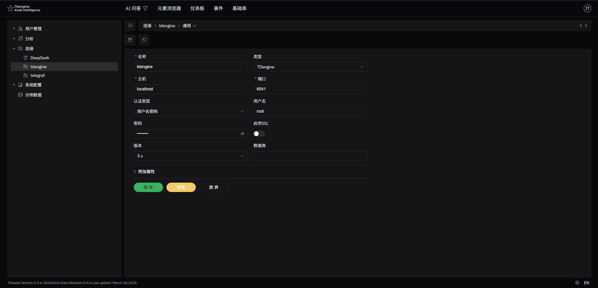
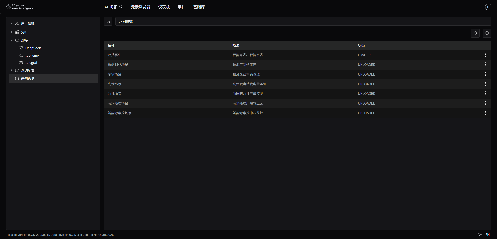
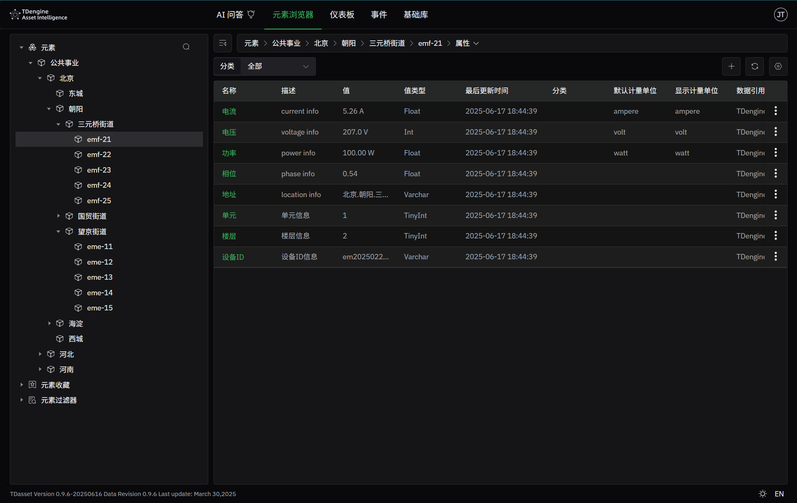

# 快速体验

TDengine Asset Intelligence 充分利用 AI 大模型技术，能基于采集的数据自动感知应用场景，自动生成实时分析、报表与可视化看板，大幅降低了使用门槛，并能帮助用户发掘出诸多新颖的报表与看板，大幅降低了对数据分析师、流程工程师的需求和依赖，缩短了从原始数据到商业洞察、决策之间的距离，提升了数据消费的效率。

本章节将带您体验从下载、安装、启动服务开始，到通过 Web 页面完成配置、分析等操作的完整流程。

:::info
TDengine AI 不仅提供容器化部署、安装包部署，还提供全托管的 TDengine AI Cloud 服务，您只需几步注册即可轻松体验 TDengine AI 提供的数据管理服务，欢迎前往 TDengine AI Cloud 注册页面试用。
:::

## 快速安装

TDengine AI 支持多种安装方式，包括容器化部署、安装包部署在物理服务器或虚拟机上，针对安装包部署形式，目前我们支持以下操作系统：

- RedHat
- CentOS
- SUSE
- Ubuntu
- Debian
- Linux
- macOS
- Windows

如您需要适配其他硬件平台或操作系统，可以[联系我们](https://www.taosdata.com/contactus)获取支持。

### 通过 Docker 容器运行

TDengine AI 提供了 Docker 镜像，用户可以通过 Docker 快速启动 TDengine AI 服务。以下是启动步骤：

1. 克隆 [tdengine-ai-deployment](https://github.com/taosdata/tdengine-ai-deployment) 仓库
   ```bash
   git clone https://github.com/taosdata/tdengine-ai-deployment.git
   ``` 
2. 使用 Docker Compose 启动 TDengine AI
   ```bash
   cd tdengine-ai-deployment/docker
   docker compose up -d
   ```

该命令会自动拉取所需镜像（如本地不存在），并以后台模式启动 **TDengine AI 服务和 TDengine TSDB 服务**。默认情况下，TDengine AI 服务会启动在主机的 6042 端口：[http://localhost:6042](http://localhost:6042)
:::tip
如需修改端口，可编辑 `docker-compose.yml` 文件中的 `ports` 配置
:::

### 通过安装包运行

TDengine AI 提供了多平台安装包，以下步骤将以 Linux 系统为例演示如何下载并安装 TDengine AI。
1. 前往 [TDengine AI 下载页面](./release-history/version)。
2. 选择 tar.gz 安装包，选择最新版本，点击链接下载。
3. 解压并执行安装脚本完成安装（请将 `<version>` 替换为实际版本号）。
   ```bash
   tar xf tdengine-ai-enterprise-<version>-linux.tar.gz 
   cd tdengine-ai-enterprise-<version>
   ./install.sh
   ```
4. 安装完成后，运行以下命令启动 TDengine AI 服务：
   ```bash
   svc-tdengine-ai start
   ```
至此，TDengine AI 服务已在主机的 6042 端口启动：[http://localhost:6042](http://localhost:6042)

## 快速体验

本节介绍如何使用 TDengine AI 完成示例数据的导入和元素的展示。

:::tip
前置准备

如果使用 Docker 容器安装方式，可以直接在本地部署最新可用的 TDengine 服务。
如果使用安装包方式，则需要额外部署一套可访问的TDengine：
服务器地址：通常是TDengine服务的IP地址，比如localhost
端口号：通常为6041
:::
### 创建连接

1. 在浏览器中输入 [http://localhost:6042](http://localhost:6042) 访问 TDengine AI 服务，使用默认用户名密码 jhtao@taosdata.com/123456 登录系统。
2. 登录到主页面后，在右上角头像下拉框中选择管理后台。
3. 在打开的管理后台页面左侧菜单栏中，选择连接，点击添加新连接。目前支持的连接类型为 TDengine 和 AI，其中 TDengine 为数据库连接，AI 为大模型连接。后续我们还会支持 MySQL 和 InfluxDB 两种连接类型。
4. 在新弹出的连接信息页面，可以配置连接信息。将连接名称配置为 TDengine，连接类型选择 TDengine，主机名称为 TDengine 服务地址，端口配置 6041。认证类型可以选择用户名密码/令牌，这里选择用户名密码方式，并配置用户名为 TDengine 数据库的用户名（一般默认为 root），密码为 TDengine 数据库用户的密码（一般默认为 taosdata）。配置好的连接信息如下图所示。

5. 完成配置后，点击保存，即可成功创建与 TDengine 服务的连接。
### 导入示例数据

在当前版本中，我们提供了公共事业、卷烟制丝场景、车辆场景、光伏场景、油井场景、污水处理场景、新能源集控场景等7大场景的示例数据。这里我们采用公共事业场景作为示例数据
1. 在管理后台页面左侧菜单栏，点击示例数据。
2. 选择公共事业所在行最右侧的按钮，在弹出的选项中选择加载。
3. 等待示例数据状态从 UNLOAD 变为 LOADED。



### 查看导入的元素信息

1. 完成公共事业在顶层菜单中选择元素浏览器，切换至元素浏览器页面。
2. 在左侧元素列表，可以查看到导入的公共事业元素。
3. 公共事业元素下，共有北京、河北、河南三个省级地区，每个省级地区都有各自的地级市区。
4. 选择北京-朝阳-三元桥街道-emf-21元素，查看其通用信息，可以看到这是一个智能电表；查看其属性信息，可以看到电流、电压等物理量属性。


### 体验 AI 生成面板

在 TDengine AI 中，最强大的功能之一是通过 AI 进行面板自动生成，我们下面以公共事业示例数据中的元素来体验一下。
1. 选择北京-朝阳-三元桥街道-emf-21元素，会自动跳转到该元素的面板页面，并且会自动开始进行AI面板生成。AI 每次会至少推荐5个面板，如果对AI推荐的面板不满意，也可以在下部对话框中以对话的方式告诉 AI 想要的模板。
2. 在 AI 推荐的问题中，选择“emf-21过去一周每天的电流和电压平均值，折线图”，点击生成
3. 等待一段时间，AI即可生成对应的面板
4. 选择生成的面板，点击详情，可跳转至面板详情页面，查看更多信息。


## 通过云服务快速体验

TDengine AI 提供了云服务版本，用户可以通过云服务快速体验 TDengine AI 的强大功能，而无需进行本地安装和配置。

## 下一步

至此，我们已经完成基本的 TDengine AI 安装、启动，并通过示例数据体验了元素导入和AI自动成功面板功能，您还可以继续进行[仪表板](/docs/04-feature/04-dashboard.md)、[分析](docs/04-feature/03-analysis.md)等功能的体验。